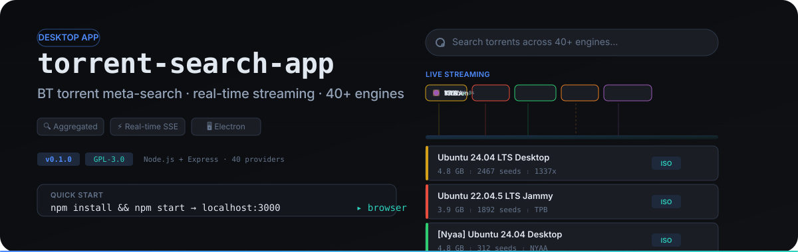
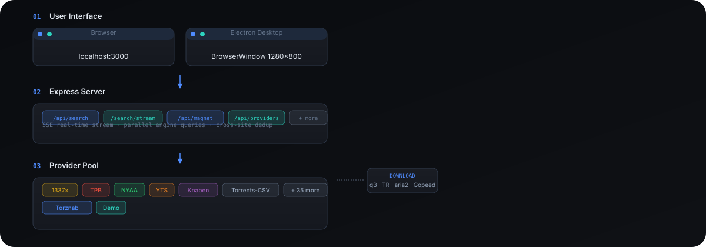

# BT 聚合搜索 · Torrent Meta-Search

<p align="center">
  
</p>

一个面向桌面的 **BT 种子聚合搜索引擎**。输入一个关键词，**40+ 个种子站点**并行检索，结果通过 SSE 实时流入、跨站去重合并为一张卡片——不依赖任何第三方服务，全量在本地运行。

> ⚠️ **本项目由 AI 辅助生成**，参考 [prajwalch/TorrentSearch](https://github.com/prajwalch/TorrentSearch)（Kotlin/Android 原生应用）的多引擎并行聚合思路，重写为 Node/Express 后端 + 原生 JS 前端 + Electron 桌面壳。代码可供学习、修改与再分发，但**不保证完整性与安全性**，使用前请自行审阅。

<br>

<details open>
<summary><strong>✨ 核心功能一览</strong></summary>

| | 功能 | 说明 |
|---|------|------|
| 🔍 | **多引擎并行搜索** | 40+ 引擎同时查询，单引擎失败不影响其他；SSE 实时流逐引擎显示 ✓/✕ 状态与耗时 |
| ⚡ | **跨站去重合并** | 同一资源按 infoHash 自动去重，多站命中合并为一张卡片 |
| 🏷️ | **画质快捷筛选** | 4K / 1080p / 720p / HDR·Dolby 快捷标签，标题命中搜索词黄色**高亮** |
| 📂 | **内容分类筛选** | 自动归类到 电影 / 剧集 / 动漫 / 游戏 / 软件 / 书籍 / 音乐 → 动态 chips 筛选 |
| 🔄 | **无限滚动** | IntersectionObserver 触底自动加载下一页 |
| 📋 | **引擎分组管理** | 综合 / 动漫 / 影视 / 成人 / 其他 / 自定义 分组，一键全选/全不选，选中项持久化 |
| 🎯 | **搜索结果排序** | 相关度（启发式打分）/ 做种数 / 大小 / 时间 + 升/降序 |
| 📚 | **搜索历史 & 收藏** | 最近搜索下拉（可删/清空）；收藏夹含磁力快照跨会话可用 |
| ⬇️ | **多下载器一键推送** | 支持 **qBittorrent / Transmission / aria2·Motrix / Gopeed** 四种下载器；每次启动自动探测本机默认端口 |
| 📤 | **批量操作** | 勾选多条卡片 → 批量推送 / 批量复制磁力 / 导出 CSV（带 BOM） |
| 📄 | **详情预览** | 弹窗聚合：做种/大小/分类/infoHash/磁力 + 各来源详情页外链 |
| 🧩 | **Torznab 自定义索引器** | 接入 Jackett / Prowlarr / *arr 自建索引器，归入「自定义」分组 |

</details>

<br>

## 🚀 开箱即用

### 桌面应用（推荐）

前往 [Releases](https://github.com/NoNameLeGo/torrent-search-app/releases) 下载安装包：

- **Electron 版**（`BT-Search-Electron-Setup-*.exe`）— 稳定，开箱即用，推荐日常使用
- **Tauri 版**（`BT-Search-Tauri-Setup-*.exe`）— 实验性，体积更小、内存更省

两款搜索功能与界面完全一致，**开 = 启动，关 = 净退出**，不留残留进程。

<details>
<summary>其他运行方式（便携版 / 开发模式 / 浏览器）</summary>

### 免安装便携版

位于 `dist/portable/torrent-search-app/torrent-search-app.exe`，**直接双击**即用——不写注册表、不落 C 盘、整包剪切即可迁移。体积约 **360MB**（主要含 Chromium 运行时）。

### 开发模式

```bash
npm install
npm run electron    # 开发模式：直接打开桌面窗口（自动选空闲端口）
npm run dist        # 打包 Windows 安装包 → dist/
```

### 浏览器方式（本地后端）

```bash
npm install
npm start           # 或 node server.js → http://localhost:3000
```

默认端口 3000，可用 `PORT=8080 node server.js` 覆盖。双击 `start.bat` / `stop.bat` 可一键启停。

</details>

<br>

## 🏗️ 架构

<p align="center">
  
</p>

采用**服务端代理**架构——所有对第三方站点的抓取在 Node 后端完成，前端只与本地 API 通信，天然规避浏览器的跨域（CORS）限制。

**公共层职责：**
- `src/lib/http.js`：请求封装（UA 轮换）**永不抛异常**，失败返回 `{ error }`
- `src/lib/normalize.js`：大小解析（`1.2 GB` → 字节）、相对时间（`2 hours ago` → 时间戳）、磁力构造、统一字段到 `TorrentResult`
- 各引擎模块导出统一接口：`search(query, { page }) → { results, error, hasMore }`

<br>

## 🔍 已集成引擎

源自 [prajwalch/TorrentSearch](https://github.com/prajwalch/TorrentSearch) 的 **40 个内置站点**，加本地 Demo 与 Torznab 自定义索引器。UI 中按分组一键全选 / 全不选。

| 分组 | 引擎 |
|------|------|
| **综合** (15) | The Pirate Bay, 1337x, Knaben, Torrents-CSV, BT4G, BTDigg, LimeTorrents, TorrentDownload(s), TorrentDatabase, TorrentKitty, uindex, ZeroMagnet, BitSearch, Internet Archive, FileMood |
| **动漫/亚洲** (10) | NYAA, AniLibria, AnimeTosho, AniRena, Bangumi Moe, 动漫花园(dmhy), Mikan, SubsPlease, 東京トショカン, NekoBT |
| **影视/剧集** (7) | EZTV, YTS, TheRARBG, Torrent9, OxTorrent, Rutor, MegaPeer |
| **成人** (4) | Sukebei, MyPornClub, XXXClub, XXXTracker |
| **其他** (3) | AudiobookBay（有声书）, BlueROMs（ROM）, LinuxTracker（Linux 发行版） |
| **自定义** | 用户通过 Torznab（Jackett / Prowlarr / *arr）添加 |
| **Demo** | 离线演示引擎，生成确定性拟真数据——网络受限时界面可正常演示 |

> 引擎能力差异：`1337x` 磁力在详情页点击惰性解析；翻页引擎从第 2 页起继续，单次返回型引擎只在首页后结束。

<br>

## 🖥️ 桌面应用

**Electron 主进程** (`electron/main.js`)：
- 启动时自动分配空闲端口
- 单实例锁（重复双击聚焦已有窗口）
- 窗口 1280×800、深色背景无白闪
- 后端在主进程内以 `require('./server').start(port)` 启动，关闭即净退出

**双构建对比：**

| | Electron | Tauri |
|---|---|---|
| 定位 | **稳定版**（推荐日常） | **实验性**，体积更省 |
| 安装包 | ~70–90MB / 便携版 ~360MB | 显著更小（复用系统 WebView） |
| 渲染 | 自带 Chromium，各机一致 | 依赖系统 WebView2（Win10+ 已内置） |
| 构建 | GitHub Actions 自动构建，打 `v*` tag 时发布 | `feat/tauri` 分支，CI 自动出包 |

<br>

## ⚠️ 说明与边界

- 第三方站点可能因区域 / 网络被屏蔽；状态栏逐引擎显示 ✓/✕
- 抓取依赖公开页面结构，若目标站点改版需同步更新对应 provider
- 本工具仅做搜索聚合，不托管、不分发任何版权内容
- 生产部署建议补充：请求速率限制、结果缓存、遵守站点 `robots.txt` 与当地法规
- **安全提示**：Torznab 配置（含 API Key）存储于本地 `data/torznab.json`，该文件已被 `.gitignore` 忽略，不会入库。若将应用部署为公开服务，请务必限制绑定地址至 `127.0.0.1`，避免暴露后端代理端点。
- **导出安全**：CSV 导出仅转义引号/逗号，若种子标题以 `=` / `+` / `-` / `@` 开头，用 Excel/WPS 打开时可能被当作公式执行（公式注入）。导出的 CSV 建议用文本编辑器或受信任的工具打开。

<br>

## 🗺️ 路线图

**已上线：** 画质筛选 / 关键词高亮 / 搜索历史 & 收藏 / 引擎分组 / 批量操作 & 导出 CSV / 详情预览 / SSE 实时流 / 跨站 infoHash 去重 / 内容分类筛选 / 多下载客户端推送（qB/TR/aria2/Gopeed）/ 安全模式 / 已浏览置灰

**候选（按性价比排序）：**

- [ ] **导出完整性提示** 🔵 — 导出 CSV / 批量复制磁力时，未解析的磁力条目当前静默留空/跳过，建议导出前提示「有 N 条磁力未解析，是否先解析」
- [ ] **引擎失败详情** 🟡 — 状态栏 ✓/✕ 之外，点引擎徽章查看最近失败原因（站点屏蔽 vs 改版），便于判断是否换镜像/等待
- [ ] **Tauri 版转正** 🟢 — 打包流程已建，充分验证后升为稳定版
- [ ] **收藏 & 记录导出 / 导入** 🟢 — 收藏、搜索历史、已浏览记录都只存 localStorage，清缓存即丢；补 export/import 文件
- [ ] **热门 / 最新浏览** 🟡 — 不输关键词也能逛，部分引擎支持后做
- [ ] **更丰富的详情（海报 / 截图）** 🟡 — 依赖各站详情页结构，ROI 一般
- [ ] **更多下载客户端** 🟡 — 在现有四种基础上扩展（如 Deluge）

<br>

<br>

<p align="center">
  <a href="https://github.com/oil-oil/beautify-github-readme"></a>
</p>

## 📄 许可证

本项目以 **GNU General Public License v3.0** 发布。

> 选用 GPL-3.0 而非 AGPL-3.0：本项目是**本地运行的桌面应用**，不提供公开网络服务。若你将其部署为公开的在线搜索服务，建议改用 **AGPL-3.0**。

完整许可证文本见 [LICENSE](./LICENSE)。
